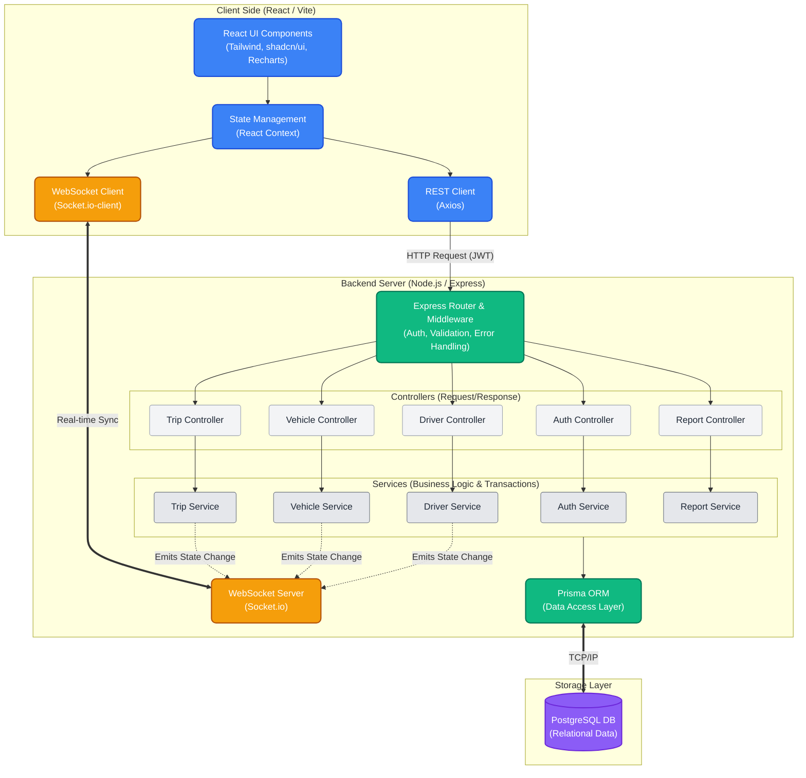
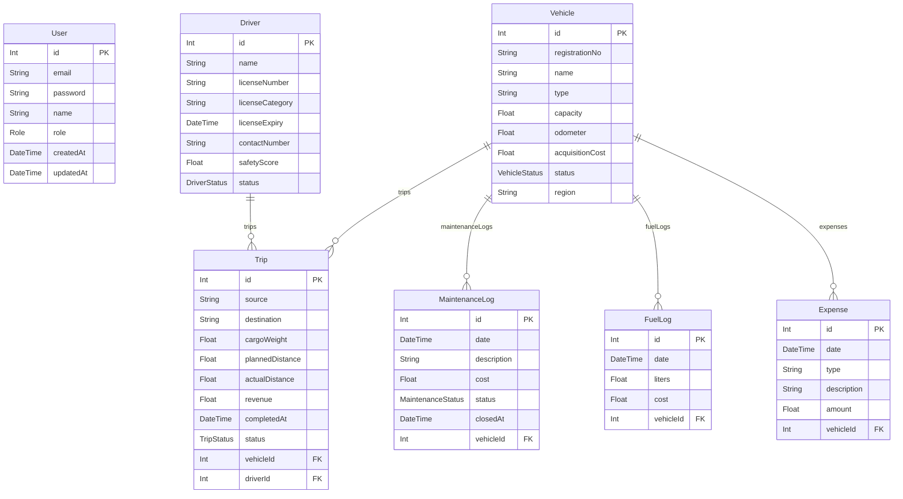

# TransitOps 🚚 - Odoo Hackathon Submission

TransitOps is a modern, real-time fleet management and logistics dashboard built from scratch. It minimizes reliance on 3rd-party APIs, relying instead on a robust, bespoke full-stack architecture designed for performance, modularity, and an intuitive user experience.

---

## 📸 Application Showcase & Features

### 1. 📊 Interactive Dashboard
* **Use Case:** Monitor key metrics like active trips, vehicles in maintenance, driver statuses, and fleet utilization with dynamic, real-time charts. Get a bird's-eye view of your entire operation at a single glance.
<br>


### 2. 💸 Expenses & Direct Fuel Logging
* **Use Case:** Keep a strict record of all operational costs including insurance, tolls, and permits. Includes a dedicated modal to log fuel usage directly against individual vehicles.
<br>


### 3. 📈 Reports & Analytics
* **Use Case:** Export actionable insights via CSV, including fuel efficiency, vehicle ROI, and operational costs. View a graphical breakdown (Bar Charts) of total expenses for each individual vehicle to quickly identify cost outliers.
<br>


### 4. 👥 Driver Management & Safety Scoring
* **Use Case:** Manage driver profiles, track license categories and expiries, and monitor safety scores to ensure fleet compliance and driver accountability.
<br>


### 5. ⚙️ Settings & Customization
* **Use Case:** Personalize the dashboard interface. The application features native support for a sleek Dark Mode to reduce eye strain during late-night monitoring.
<br>


*(Note: Please ensure the screenshots are placed in a `docs/` folder in the root directory with the matching filenames).*

---

## 🚀 Try it Out! (Live Demo Credentials)

Explore the platform as an administrative **Fleet Manager** using the seeded demo credentials:

> 📧 **Email:** `fleet@transitops.com`
> 🔑 **Password:** `password123`

---

## ✨ Core Technical Features

- **Real-Time Synchronization**: Sockets (`socket.io`) instantly push state changes (like trip dispatches and completions) across all connected clients without page reloads.
- **Dynamic Analytics Dashboard**: Beautiful, responsive charts built with `Recharts`.
- **Robust Input Validation**: Strict client-side validation powered by `Zod` and `React Hook Form` ensures data integrity.
- **Premium UI/UX**: Built with `Tailwind CSS`, `shadcn/ui`, and `Framer Motion` for smooth page transitions and animated Skeleton loaders.
- **Atomicity**: Complex database operations are wrapped in Prisma Transactions to ensure 100% data consistency.

---

## 🏗 Architecture & Tech Stack

The project follows a strict modular Service-Controller-Router pattern.

### Backend
- **Runtime**: Node.js & Express.js (TypeScript)
- **Database**: PostgreSQL (via Prisma ORM)
- **Real-Time**: Socket.io
- **Security**: JWT Authentication, bcrypt password hashing, CORS.

### Frontend
- **Framework**: React.js (Vite) & TypeScript
- **Routing**: React Router v6
- **Styling**: Tailwind CSS, shadcn/ui
- **State/Fetching**: Axios, Context API
- **Charts**: Recharts

### System Flow


---

## 🗄️ Database Entity-Relationship Diagram (ERD)



---

## ⚙️ Getting Started

### Prerequisites
- Node.js (v18+)
- PostgreSQL installed and running locally

### 1. Database Setup
Ensure PostgreSQL is running. Open your terminal and create the database:
```bash
createdb transitops
```

### 2. Backend Setup
```bash
cd backend
npm install

# Setup environment variables
cp .env.example .env
# Edit .env with your Postgres connection string

# Run migrations and seed data
npx prisma migrate dev --name init
npm run seed

# Start the dev server
npm run dev
```
The backend will run on `http://localhost:5000`.

### 3. Frontend Setup
In a new terminal window:
```bash
cd frontend
npm install

# Start the Vite server
npm run dev
```
The frontend will run on `http://localhost:5173`.

---

## 🛠 Design Decisions & Hackathon Criteria

1. **Clean Code & Modularity**: The backend strictly separates concerns (Routes -> Controllers -> Services) making it highly maintainable.
2. **Database Design**: The PostgreSQL schema utilizes Native Enums and strict referential integrity to enforce business rules.
3. **User Error & Usability**: Replaced native generic alerts with intuitive inline Zod validation and non-blocking toast notifications.
4. **Performance & Scalability**: Skeleton loaders keep perceived performance high, while backend transactions prevent race conditions during concurrent updates.

---
*Built with ❤️ for the Odoo Hackathon.*
